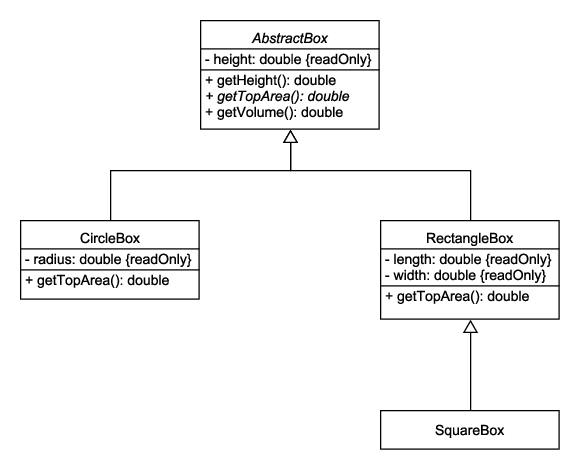

# Inheritance

Inheritance is a core concept in object-oriented programming (OOP) languages like C++, C#, and Java. Inheritance is the mechanism of basing an object or class upon another object or class. It can be defined as deriving new classes (sub classes) from existing ones. The derived class inherits the attributes and methods of the base class and can extend the base class by adding new attributes and methods. This promotes code reuse and establishes relationships between classes.

For example, let's say you wanted to represent different types of boxes that are identified by the shape of their top and bottom surfaces (which are the same):

1. Circle box (for example, a soda can)
2. Rectangle box (for example, a tissue box)
3. Square box (a rectangle box where the length and width are the same)

Each type of box has a height. We should be able calculate the volume of each type of box.

You might design classes like this:



Here is how the `AbstractBox` class might be implemented:

```java
public abstract class AbstractBox {
    private final double height;

    public AbstractBox(double height) {
        if (height <= 0) {
            throw new IllegalArgumentException("height must be positive");
        }

        this.height = height;
    }

    public double getHeight() {
        return height;
    }

    public abstract double getTopArea();

    public double getVolume() {
        return height * getTopArea();
    }
}
```

`AbstractBox` is an **abstract class**. An abstract class cannot be instantiated, usually (but not always) because a method is declared but not implemented. In this case, the `getTopArea()` method is declared `abstract`, so derived classes must implement it.

In UML, the name of an abstract class or method is shown in italics.

The `AbstractBox` class contains a property for the height. In Java, the `final` keyword means that once it is assigned a value, it cannot be assigned a new value. In C#, you would use the `readonly` keyword. In UML, you mark the property with the `{readOnly}` modifier.

The `AbstractBox` class implements the `getVolume()` method, which just returns the product of `height` and `getTopArea()` (which will be implemented by the derived classes)

For example, the area of a rectangle is the product of the length and width. Therefore, the `RectangleBox` class might be implemented like this:

```java
public class RectangleBox extends AbstractBox {
    private final double length;
    private final double width;

    public RectangleBox(double height, double length, double width) {
        super(height);

        if (length <= 0) {
            throw new IllegalArgumentException("length must be positive");
        }

        if (width <= 0) {
            throw new IllegalArgumentException("width must be positive");
        }

        this.length = length;
        this.width = width;
    }

    @Override
    public double getTopArea() {
        return length * width;
    }
}
```

Since `RectangleBox` is derived from `AbstractBox`, you can call methods that are implemented in `AbstractBox`. For example, for a box of height 3.0, length of 4.0, and a width of 5.0:

```java
RectangleBox box = new RectangleBox(3, 4, 5);
double height = box.getHeight(); // returns 3
```

A `SquareBox` is just a special type of `RectangleBox` where the length and width are the same:

```java
public class SquareBox extends RectangleBox {
    public SquareBox(double height, double side) {
        super(height, side, side);
    }
}
```

Some languages (like C++) allow a derived class to extend more than one base class. Other languages (like C# and Java) only allow a derived class to extend one base class. However, this limitation is rarely a problem.
